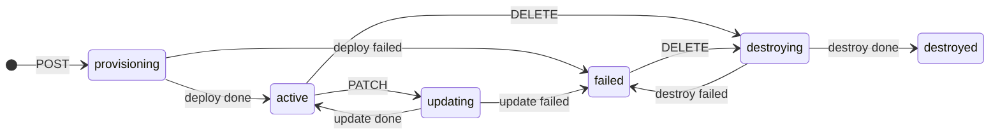
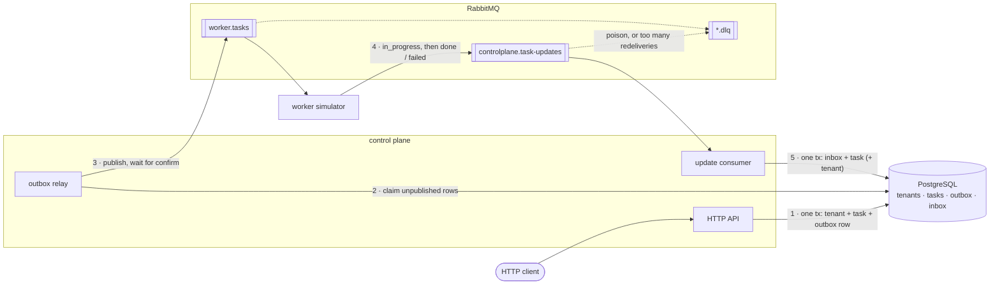

# tenant-service

A tenant provisioning control plane. Creating a tenant records it and emits a task; a worker picks the task up, "provisions" the tenant, and reports progress back over a message queue; the control plane applies that progress to the task and, when the task finishes, to the tenant.

Go 1.27 · PostgreSQL 18 · RabbitMQ 4.3 · everything runs in Docker.

- [Quick start](#quick-start)
- [Walkthrough](#walkthrough)
- [Negative scenarios](#negative-scenarios)
- [API reference](#api-reference)
- [Architecture](#architecture)
- [Design decisions and trade-offs](#design-decisions-and-trade-offs)
- [Tests and quality gates](#tests-and-quality-gates)
- [Reference](#reference)

## Quick start

You need **Docker** (with Compose v2) and **make**. Nothing else: Go, the linters and the test toolchain all run in containers.

```bash
git clone https://github.com/Ankitwasnik/tenant-service.git && cd tenant-service
make up     # builds and boots everything, and waits until it's healthy
make test   # runs the full test suite
```

The first `make` run creates `.env` from [`.env.template`](.env.template); all settings (credentials, host ports, worker flags) live there, and `compose.yaml` has no defaults of its own. They're local-development values, not secrets. To change one, edit `.env` (git-ignored), or set it for one command: `API_HOST_PORT=9090 make up`.

`make check` runs every quality gate: format check, sqlc staleness check, lint (golangci-lint with gosec, and shellcheck), vulnerability scan (govulncheck), then the tests.

`make up` publishes three ports, on `127.0.0.1` only:

| Port | What |
| ---- | ---- |
| `8080` | the HTTP API (`API_HOST_PORT`) |
| `15672` | RabbitMQ management UI, user `controlplane`, password `controlplane` (`RABBITMQ_MGMT_HOST_PORT`) |
| `6432` | PostgreSQL, for a desktop client such as DBeaver or `psql`: database, user and password all `controlplane` (`POSTGRES_HOST_PORT`) |

Postgres is on 6432 rather than 5432 so it doesn't clash with a Postgres already on your machine; AMQP (5672) isn't published at all. `make down` stops everything and keeps the data (tenants survive `make down && make up`); `make clean` also deletes it.

## Walkthrough

Create a tenant. It exists straight away, in `provisioning`, with a `deploy` task:

```bash
curl -i -X POST localhost:8080/v1/tenants \
  -H 'Content-Type: application/json' \
  -d '{"slug":"acme","name":"Acme Corp"}'
```

```http
HTTP/1.1 201 Created
Location: /v1/tenants/01a0e240-9a22-7d72-a961-2001bdf79e8a

{"tenant":{"id":"01a0e240-9a22-7d72-a961-2001bdf79e8a","slug":"acme","name":"Acme Corp","status":"provisioning","version":1,"created_at":"2026-09-27T09:44:39.715Z","updated_at":"2026-09-27T09:44:39.715Z"},
 "task":{"id":"01a0e240-9a23-70b8-8d27-22daa59ce63d","type":"deploy","tenant_id":"01a0e240-9a22-7d72-a961-2001bdf79e8a","status":"accepted","created_at":"2026-09-27T09:44:39.715Z","updated_at":"2026-09-27T09:44:39.715Z"}}
```

With no manual steps, the worker moves the task `accepted` → `in_progress` → `done` (0.5–2 s per step by default), and the tenant `provisioning` → `active`. Watch it happen:

```bash
ID=01a0e240-9a22-7d72-a961-2001bdf79e8a    # the tenant id from the response

curl -s localhost:8080/v1/tenants/$ID                 # "status":"active","version":2
curl -s "localhost:8080/v1/tasks?tenant_id=$ID"       # the deploy task, "status":"done"
```

Rename it. PATCH takes the version you last saw, for optimistic locking; the rename completes asynchronously, so it returns `202` and the `update` task:

```bash
curl -s -X PATCH localhost:8080/v1/tenants/$ID -d '{"name":"Acme Inc","version":2}'
# → tenant "updating", version 3; a moment later "active", version 4

curl -s -X PATCH localhost:8080/v1/tenants/$ID -d '{"name":"Acme Ltd","version":2}'
# → 409 {"error":{"code":"tenant_version_conflict","message":"expected version 2, current is 4","details":{"current_version":4}}}
```

Delete it. The tenant goes `destroying` → `destroyed`, and stays readable, with its task history:

```bash
curl -s -X DELETE localhost:8080/v1/tenants/$ID       # 202, "destroying"
curl -s localhost:8080/v1/tenants/$ID                 # "destroyed"
```

`make logs` follows everything; the control plane logs each update it applies with its `update_id`, `task_id` and result.

## Negative scenarios

### Failures and delays: restart the worker with different settings

```bash
make worker ARGS="--fail-rate=1"                              # every task fails
make worker ARGS="--min-delay-ms=5000 --max-delay-ms=10000"   # slow worker
make worker ARGS="--fail-rate=0.3"                            # 30% of tasks fail
make worker                                                   # back to the defaults
```

`make worker` replaces the running worker rather than starting a second one: two workers would share the task queue, and only some tasks would see the new settings.

| Flag | Env var | Default | Effect |
| ---- | ------- | ------- | ------ |
| `--min-delay-ms` | `WORKER_MIN_DELAY_MS` | 500 | lower bound of the random delay before each step |
| `--max-delay-ms` | `WORKER_MAX_DELAY_MS` | 2000 | upper bound |
| `--fail-rate` | `WORKER_FAIL_RATE` | 0 | probability, 0–1, that a task ends `failed` |

With `--fail-rate=1`, a new tenant ends `failed` and its task carries `"error":"simulated failure"`. A failed tenant can only be deleted; with the worker still failing, the destroy fails too, and the tenant is `failed` again. Run `make worker`, delete again, and it's `destroyed`.

### Duplicates, out-of-order updates and poison messages: publish to the broker directly

`scripts/publish-update.sh` publishes an update as if the worker had sent it (bash and curl only; `--help` for all options). `--task-id latest` picks the newest task, so these work as-is after the walkthrough above:

```bash
# Duplicate: the same update twice. The first is processed, the second is
# recognised by its update_id and changes nothing.
scripts/publish-update.sh --task-id latest --status failed --error "disk full" --count 2

# Out of order: in_progress for a task that is already done. Stale: nothing regresses.
scripts/publish-update.sh --task-id latest --status in_progress

# Poison: not JSON, an invalid status, an unknown task. Each goes to the
# dead-letter queue, and the consumer carries on with the next message.
scripts/publish-update.sh --raw 'this is not json'
scripts/publish-update.sh --task-id latest --status accepted
scripts/publish-update.sh --task-id 00000000-0000-4000-8000-000000000000 --status done
```

To see the outcomes:

```bash
docker compose logs controlplane | grep -E '"update processed"|dead-letter'
```

The log lines are JSON; trimmed to the relevant fields, they read:

```text
"msg":"update processed", "status":"failed", "result":"stale"       ← the task was done; failed can't flip it
"msg":"update processed", "status":"failed", "result":"duplicate"   ← the second copy
"msg":"update processed", "status":"in_progress", "result":"stale"
"msg":"malformed update; dead-lettering it", ...
```

The dead-lettered messages are in `controlplane.task-updates.dlq`, in the management UI at <http://localhost:15672/#/queues>. The tenant is unchanged throughout.

For a duplicate of real worker traffic, replay one of the worker's own updates: the control plane logs every `update_id`, and `--update-id <that id>` with the same `--task-id` and `--status` is logged as `duplicate`.

## API reference

JSON only. Unknown fields in a request body are rejected. Timestamps are ISO 8601 with milliseconds and `Z`.

**Postman:** import [`docs/postman/tenant-service.postman_collection.json`](docs/postman/tenant-service.postman_collection.json). Folder 1 walks the whole lifecycle in order; run it with the Collection Runner, since it waits for the worker between steps. Folder 2 covers lists and pagination, and folder 3 every error code. Every request has tests, and ids, the version and the page cursor are captured automatically. It's also runnable headless: `docker run --rm -v "$PWD/docs/postman:/etc/newman" postman/newman:6-alpine run tenant-service.postman_collection.json --env-var baseUrl=http://host.docker.internal:8080`.

| Method | Path | Success | Errors |
| ------ | ---- | ------- | ------ |
| `POST` | `/v1/tenants` | `201` + `Location`, body `{tenant, task}` | `400` `validation_error`, `409` `tenant_already_exists` |
| `GET` | `/v1/tenants` | `200` page of tenants (every status, `destroyed` included) | `400` |
| `GET` | `/v1/tenants/{id}` | `200` tenant | `404` `tenant_not_found` |
| `PATCH` | `/v1/tenants/{id}` | `202` `{tenant, task}` | `400`, `404`, `409` `tenant_version_conflict`, `409` `tenant_update_not_allowed` |
| `DELETE` | `/v1/tenants/{id}` | `202` `{tenant, task}` | `404`, `409` `tenant_update_not_allowed` |
| `GET` | `/v1/tasks[?tenant_id=]` | `200` page of tasks | `400` |
| `GET` | `/v1/tasks/{id}` | `200` task | `404` `task_not_found` |
| `GET` | `/healthz` | `200` (the database answers) | `503` `service_unavailable` |

- **Create** body: `{"slug": "...", "name": "..."}`. The slug is 3–28 characters, `^[a-z][-a-z0-9]{1,26}[a-z0-9]$`, and unique forever, including against destroyed tenants. The name is trimmed, non-empty and at most 200 characters.
- **PATCH** body: `{"name": "...", "version": N}`, both required. Allowed only from `active`. `slug` can't be changed.
- **DELETE** is allowed from `active` and `failed`. It takes no version.
- **Pagination**: newest first. `?limit=` (default 50, max 200) and `?cursor=` (the previous page's `next_cursor`). Page body: `{"items": [...], "next_cursor": "..." | null}`.
- A malformed id in the path gets the resource's `404`, the same as an unknown one. A malformed query parameter is a `400`.

Every error has the same shape:

```json
{"error": {"code": "tenant_version_conflict", "message": "expected version 3, current is 4", "details": {"current_version": 4}}}
```

| Code | Status | When |
| ---- | ------ | ---- |
| `validation_error` | 400 | bad body or query parameter; `details` names each bad field |
| `tenant_not_found` | 404 | unknown tenant id |
| `task_not_found` | 404 | unknown task id |
| `tenant_already_exists` | 409 | the slug is taken |
| `tenant_version_conflict` | 409 | PATCH with a stale `version`; `details.current_version` |
| `tenant_update_not_allowed` | 409 | PATCH or DELETE not allowed from the tenant's status; `details.status` |
| `not_found` / `method_not_allowed` | 404 / 405 | unknown route, or wrong method on a route |
| `internal_error` | 500 | anything unexpected; details are logged, never returned |
| `service_unavailable` | 503 | `/healthz` only: the database doesn't answer |

### State machines



A task goes `accepted` → `in_progress` → `done` or `failed`. At most one task per tenant is open at a time; that follows from the tenant rules above (a PATCH or DELETE needs a tenant with no task in flight).

## Architecture



Two binaries, one image:

- **`controlplane`**: the HTTP API, the outbox relay and the update consumer, as goroutines in one process sharing one database pool. On SIGTERM they stop together; in-flight messages are requeued.
- **`worker`**: the provisioning simulator. It consumes tasks and reports progress; no HTTP.

1. An API call that changes a tenant writes the tenant, its new task and an **outbox** row in one transaction. The API never talks to the broker.
2. The **relay** polls the outbox (every 200 ms), claiming unpublished rows with `FOR UPDATE SKIP LOCKED`.
3. It publishes them to `worker.tasks` with publisher confirms, and marks as published only what the broker confirmed.
4. The **worker** does the work and publishes `in_progress`, then `done` or `failed`, to `controlplane.task-updates`, and acks the task only after both are confirmed.
5. The **consumer** applies each update in one transaction: record it in the **inbox**, update the task, and on a terminal outcome move the tenant.

## Design decisions and trade-offs

The full reasoning is in [`docs/DESIGN.md`](docs/DESIGN.md); what follows is the short version.

**Publish after commit: a transactional outbox.** The event is written as a row in the same transaction as the change, and published by the relay afterwards. A rolled-back change has no row, so nothing is ever published for it, and nothing is published before the commit, because the relay can only see committed rows. The cost is up to one poll interval of latency, and a crash between publish and mark publishes the event again: delivery is **at-least-once** by design. "Exactly one event" is read as one event per state-changing call, delivered at least once. Exactly-once delivery isn't a thing, so duplicates are made harmless on the consuming side.

**Duplicates and reordering, made harmless three ways.**

- Each update carries an **`update_id`**, the idempotency key, recorded in an `inbox` table in the same transaction as the change. A repeat is recognised and changes nothing.
- The worker derives `update_id` deterministically: UUIDv5 of the task id and status. A task delivered twice (the relay is at-least-once) produces the same ids the second time, so the inbox catches those too.
- A task only ever moves **forward**: `accepted` < `in_progress` < `done`|`failed`. An update that arrives late (`in_progress` after `done`), or for a finished task, is stale and ignored. A `done` that arrives before its `in_progress` is applied, because it's a forward move.

Two updates for the same task can be processed at once (the consumer runs 4 goroutines), so the consumer locks the task row. Without that lock, a racing `in_progress` could overwrite a committed `done`; a test that removes it fails every time.

**Concurrency without application locks.** Every API guard is a single conditional `UPDATE ... WHERE status = ... AND version = ...`, so two racing PATCHes serialize on the row, and the loser matches nothing. When a guard misses, a follow-up read picks the error, **version before status**: a racer that lost always hears `tenant_version_conflict` ("re-read and retry"), not `tenant_update_not_allowed`. Slug uniqueness is a unique index, which is what makes 50 concurrent creates yield exactly one winner. A partial unique index also enforces one open task per tenant, as a safety net under the status rules.

**RabbitMQ: quorum queues, dead-letter queues, a delivery limit.** A poison message goes to a dead-letter queue instead of blocking or crashing its consumer. `x-delivery-limit: 10` stops a message that keeps crashing its consumer from looping forever. Measured on RabbitMQ 4.3, and pinned by tests: a crash (the channel closes with the message unacked) counts toward the limit, but a `nack` with requeue doesn't. So the consumer never retries by requeueing: a transient database error is retried in-process, with jittered exponential backoff, holding the message. Publishes use confirms and `mandatory`, so an unroutable message counts as not published instead of vanishing.

**Resilience.** A lost broker connection is re-established with backoff, and the topology re-declared; unacked messages are redelivered, and unpublished events wait in the outbox. The HTTP API doesn't depend on the broker, so writes are accepted during an outage and their events go out afterwards. A transient database error (classified by SQLSTATE) is retried; anything else is permanent and dead-lettered, so a bug fails loudly.

**Choices, and what's deliberately left out:**

- **Soft delete.** A destroyed tenant stays as a row, which keeps its slug taken and its history readable.
- **PATCH writes the name immediately**, before the update task finishes. A failed update leaves a `failed` tenant with the new name. Keeping the name on the task until `done` would cost a second write path.
- **A dead-lettered task leaves its tenant stuck** in `provisioning`/`updating`/`destroying`, which can't be deleted. The production fix is a reaper that fails tasks open past a deadline. Documented, not built.
- **Failed tenants can only be deleted**, per the spec; a retry would be a new task.
- **POST isn't idempotent across client retries**; an `Idempotency-Key` header would fix that.
- **No auth, rate limiting, metrics or tracing.** Structured JSON logs carry `request_id`, `task_id`, `tenant_id` and `update_id`.
- **The outbox and inbox grow forever**; production would prune them.
- **Stack:** gin (with its defaults replaced so every error is structured JSON); pgx and sqlc, with hand-written SQL and generated wrappers (no ORM); goose migrations, embedded and run on startup. All ids and timestamps come from Postgres (`uuidv7()`, `timestamptz(3)`).

## Tests and quality gates

`make test` runs the whole suite with the race detector, in a container, against the dev stack's Postgres and RabbitMQ. Every database test gets its own fresh database, and every broker test its own vhost, so tests run in parallel and never touch your data.

- **Races** (`internal/api/race_test.go`): the in-repo proof the concurrency rules hold. Real concurrent HTTP requests, released together behind a barrier, with exact outcome counts. 50 creates with one slug → exactly 1 `201` and 49 `tenant_already_exists`. 50 PATCHes at one version → exactly 1 `202` and 49 `tenant_version_conflict`. 20 DELETEs → 1 winner. PATCH racing DELETE → exactly one wins. Each asserts the database afterwards as well: one open task, version +1.
- **Messaging:** duplicates, stale and out-of-order updates, concurrent delivery of one update, poison messages, the invariant rollback, the relay under broker failure and with several relays at once, the worker's ack ordering, reconnects after the broker force-closes a connection, and RabbitMQ's delivery-limit behavior itself.
- **End to end** (`internal/e2e`): the whole system in-process, driven only through the HTTP API: create → `active`, PATCH → `active`, DELETE → `destroyed`; the failure path with a failing worker, then recovery.
- **Unit:** the state machines table-driven over every status and transition, validation boundaries, error mapping.

### Demonstrating that the race conditions are handled

Two ways, both one command:

```bash
make race         # the concurrency tests only, verbose, with each race's outcome counts
make race-demo    # concurrent requests against the running stack (make up), tallied
```

`make race` runs every concurrency test in the repo and prints each race's result, for example:

```text
race_test.go:78: 50 requests, up to 50 in flight at once → 1 × 202, 49 × 409 tenant_version_conflict
```

`make race-demo` (`scripts/race-demo.sh`) needs only the stack from `make up`. It fires 50 identical requests at once (`curl --parallel`, one connection each) for a create, then a PATCH, then a DELETE of the same tenant, waiting for the worker in between, and checks each batch had exactly one winner:

```text
== 2. 50 concurrent PATCHes of tenant 01a0e26f-…, all with version 2
      49 409 tenant_version_conflict
       1 202 -
  PASS: exactly one of 50 won; the other 49 got tenant_version_conflict
  open tasks for the tenant: 1 (at most 1 allowed)
```

`make race-demo ARGS="--count 200"` for bigger batches.

`make check` runs, in order and stopping at the first failure: `golangci-lint fmt --diff` (gofumpt, goimports), `sqlc diff`, `golangci-lint run` (including gosec) and shellcheck, `govulncheck`, then `make test`.

## Reference

| Command | Does |
| ------- | ---- |
| `make up` | build and start everything, and wait until healthy |
| `make down` | stop; data is kept |
| `make clean` | stop and delete the data |
| `make logs` | follow all logs |
| `make worker ARGS="..."` | replace the worker with one using these flags |
| `make test` | the full test suite |
| `make race` | just the concurrency tests, with outcome counts |
| `make race-demo` | concurrent requests against the running stack, tallied |
| `make check` | every quality gate, then the tests |
| `make fmt` | format the Go code |
| `make generate` | regenerate the sqlc code after changing a query |

Configuration is environment-only. The control plane takes `DATABASE_URL`, `AMQP_URL` and `HTTP_ADDR` (default `:8080`), and the worker takes `AMQP_URL` plus its `WORKER_*` variables. Compose builds all of them from `.env`, which `make` creates from `.env.template` on first run. `compose.yaml` has no defaults of its own. The values are non-secret local-development ones; `.env` is git-ignored, and there are no secrets in the repo.

```text
cmd/controlplane/        HTTP API + relay + consumer
cmd/worker/              the worker simulator
internal/domain/         tenant and task model, state machines, validation (no I/O)
internal/store/          Postgres: migrations, sqlc queries, the repository
internal/api/            HTTP handlers, error mapping, middleware
internal/outbox/         the outbox relay
internal/consumer/       the task-update consumer
internal/worker/         the simulator's logic
internal/messaging/      RabbitMQ topology, message types, confirmed publishing, reconnects
internal/backoff/        jittered exponential backoff
internal/e2e/            end-to-end tests
scripts/                 publish-update.sh, race-demo.sh (and lib/env.sh, which both use to read .env)
docs/                    DESIGN.md (the design), PLAN.md and PROGRESS.md (how it was built), postman/ (API collection)
```
