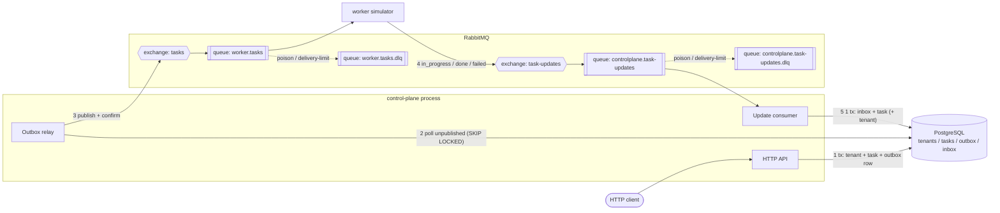

# Design - Tenant Provisioning Control Plane

Status: **implemented.** This is the design the code was built against, kept up to date as the build changed it. [`README.md`](../README.md) has the short version; [`PROGRESS.md`](PROGRESS.md) records each place the build deviated from the original plan, and why.

## 1. Stack

| Concern         | Choice                                                     | Why                                                                              |
| --------------- | ---------------------------------------------------------- | -------------------------------------------------------------------------------- |
| Language        | Go 1.27, module `github.com/Ankitwasnik/tenant-service`    | Goroutines fit "HTTP + relay + consumer in one process"; `-race` detector        |
| HTTP            | `gin`                                                      | Widely known, middleware + route groups; its defaults are overridden (see §7)    |
| DB              | PostgreSQL 18 (`postgres:18.6-alpine`), `pgx/v5` + `pgxpool` | Unique constraints, row locks, `SKIP LOCKED`; latest major version               |
| Query layer     | `sqlc` (pgx/v5 driver), SQL in `internal/store/queries/`   | SQL stays hand-written and visible; sqlc generates the typed Go wrappers. No ORM. |
| Migrations      | `goose`, SQL files embedded in the binary, run on startup  | One deployable, no extra migration container; sqlc reads the same files as its schema |
| Broker          | RabbitMQ 4.3 (`rabbitmq:4.3.6-management-alpine`), quorum queues, management plugin | Publisher confirms, manual acks, DLX, `x-delivery-limit`; HTTP publish API for scripts |
| AMQP client     | `github.com/rabbitmq/amqp091-go`                           | The official client                                                              |
| Logging         | `log/slog` JSON                                            | stdlib                                                                           |
| Lint / format   | `golangci-lint` v2: linters (incl. `gosec`) + formatters (`gofumpt`, `goimports`); `shellcheck` for `scripts/` | One tool, one config; `golangci-lint fmt` formats, `fmt --diff` checks |
| Vuln scan       | `govulncheck`                                              | Official Go vulnerability DB                                                     |
| Runner          | `make` + `docker compose`                                  | Host needs only Docker + make; no local Go toolchain                             |

## 2. Architecture



Two binaries, one Docker image:

- `cmd/controlplane`: HTTP API, outbox relay, and update consumer as three goroutines in one `errgroup`, sharing one `pgxpool`. On SIGTERM, one context is cancelled: HTTP drains via `Shutdown(ctx)`, and the relay and consumer stop at their next loop step. No finer ordering is needed: unacked messages are redelivered and unpublished outbox rows stay in the table.
- `cmd/worker`: the simulator. No HTTP.

## 3. Data model

```sql
CREATE TABLE tenants (
    id          uuid PRIMARY KEY DEFAULT uuidv7(),
    slug        text NOT NULL UNIQUE,          -- never deleted => unique vs destroyed tenants too
    name        text NOT NULL CHECK (name <> ''),
    status      text NOT NULL CHECK (status IN
                  ('provisioning','active','updating','destroying','destroyed','failed')),
    version     integer NOT NULL DEFAULT 1,
    created_at  timestamptz(3) NOT NULL DEFAULT now(),
    updated_at  timestamptz(3) NOT NULL DEFAULT now()
);

CREATE TABLE tasks (
    id          uuid PRIMARY KEY DEFAULT uuidv7(), -- also the event id
    tenant_id   uuid NOT NULL REFERENCES tenants(id),
    type        text NOT NULL CHECK (type IN ('deploy','update','destroy')),
    status      text NOT NULL CHECK (status IN ('accepted','in_progress','done','failed')),
    error       text,                           -- set when the worker reports failed
    created_at  timestamptz(3) NOT NULL DEFAULT now(),
    updated_at  timestamptz(3) NOT NULL DEFAULT now()
);
-- Safety net for "at most one open task per tenant". The status guards make it
-- unreachable; if a bug ever breaks them, the tx fails instead of corrupting state.
CREATE UNIQUE INDEX tasks_one_open_per_tenant ON tasks (tenant_id)
    WHERE status IN ('accepted','in_progress');
CREATE INDEX tasks_tenant_id ON tasks (tenant_id, id DESC);             -- GET /v1/tasks?tenant_id=
-- Unfiltered lists paginate on the primary key (id DESC); no extra index needed.

CREATE TABLE outbox (
    id           bigserial PRIMARY KEY,
    task_id      uuid NOT NULL REFERENCES tasks(id),
    routing_key  text NOT NULL,                 -- task.deploy | task.update | task.destroy
    payload      jsonb NOT NULL,                -- frozen at commit time
    created_at   timestamptz(3) NOT NULL DEFAULT now(),
    published_at timestamptz(3)
);
CREATE INDEX outbox_unpublished ON outbox (id) WHERE published_at IS NULL;

CREATE TABLE inbox (                            -- processed worker updates
    update_id    uuid PRIMARY KEY,              -- idempotency key
    task_id      uuid NOT NULL,                 -- no FK: an unknown task rolls the whole tx back anyway
    received_at  timestamptz(3) NOT NULL DEFAULT now()
);
```

Notes:

- **Soft delete.** Destroyed tenants stay as rows with `status = 'destroyed'`. That is what makes the slug unique against destroyed tenants, and it keeps their task history readable.
- **The database generates ids and timestamps.** Postgres is the source of truth for identity and time, and the app never makes up these values. Every replica then shares one clock, and the guarded UPDATEs keep all their bookkeeping in SQL (`version = version + 1, updated_at = now()`). Go generates only what the database can't: the worker's `update_id` (§6).
- **Timestamps.** `DEFAULT now()` on insert, and `updated_at = now()` in every UPDATE. Details:
  - `now()` is the **transaction start time**, so every row written in one tx (tenant, task, outbox) gets the same timestamp. That's intended: they were created together.
  - `timestamptz(3)` makes Postgres **round** to milliseconds on write, so stored values already have the precision the brief asks for.
  - Two writes in the same millisecond get equal timestamps, so tests assert "not earlier than", never "strictly later than".
  - Timestamps are informational. Ordering between writes is carried by `version`, not `updated_at`, because tx-start time can differ slightly from commit order.
  - pgx returns `time.Time` in the process's local zone, so the one JSON formatter calls `.UTC()` before formatting as `2006-01-02T15:04:05.000Z`.
  - The one exception is `outbox.published_at`, which uses `clock_timestamp()`. The relay's tx starts before it publishes, so `now()` would record a time earlier than the actual publish.
- **IDs.** UUIDv7 from Postgres 18's built-in `uuidv7()`, stored as native `uuid`. Postgres guarantees these increase within a session. Why UUIDv7:
  - **Unique beyond one table.** The task id doubles as the event id and the AMQP `message_id`, so it has to stay unique as it travels to RabbitMQ and the worker.
  - **Not guessable,** and it doesn't reveal the tenant count, unlike `bigserial`.
  - **Time-ordered,** so new rows land near each other in the index and ids roughly follow creation order.
  - **Consistent with `update_id`,** which is also a UUID (a v5 derived from the task id, see §6).
- **Postgres 18 image volume.** The `postgres:18` image moved its data directory, so the compose volume is mounted at `/var/lib/postgresql`, not `/var/lib/postgresql/data` as in older images.
- **Why a separate `outbox` table** rather than a `published_at` column on `tasks`: the payload is frozen at commit time, and the relay stays generic and never touches domain rows. The cost is one extra insert per mutation.
- **Why an `inbox` table** when the rank rule (§4) already rejects every duplicate: it makes `update_id` a real idempotency key, as the brief requires, rather than a field that is carried and never checked. Every processed update gets a row, applied or stale alike; which of the two it was is logged (and returned by the handler for tests), not stored, so the stale path needs no second write. (It would *not* by itself make an in-place retry of a failed task safe: `update_id` is derived from `task_id + status` (§6), so a retried task would emit the same ids and be deduped. A retry therefore has to create a new task, which is how §12 frames it anyway.)
- **Inbox retention.** Rows grow forever. That's fine here; in production you'd prune rows older than the broker's maximum redelivery window. Documented, not built.

### sqlc setup

- **Schema:** `sqlc.yaml` points at `internal/store/migrations/` as the schema. goose and sqlc share one source of truth, and sqlc only reads the `-- +goose Up` sections.
- **Queries:** `internal/store/queries/{tenants,tasks,outbox,inbox}.sql`, one named query per statement, e.g. `-- name: UpdateTenantIfActive :one`.
- **Generated code:** goes into `internal/store/sqlcgen/`, with `sql_package: pgx/v5` and overrides `uuid → github.com/google/uuid.UUID` and `timestamptz → time.Time` (nullable columns such as `outbox.published_at` and `tasks.error` need their own `nullable: true` overrides, to `*time.Time` and `*string`). It's **committed**, so building needs no sqlc; `make check` fails if it's stale (`sqlc diff`). `sqlc vet` is not used: without configured rules it checks little, and its built-in rules need a live database.
- **Transactions:** `internal/store` wraps the generated `*sqlcgen.Queries` in a small repository. Each API or consumer operation is one `pgx.BeginFunc(ctx, pool, func(tx) { q := queries.WithTx(tx); ... })`, so every statement in a unit of work shares the tx. Inserts omit the generated columns and use `RETURNING *`. For example, create is `InsertTenant` → `InsertTask(tenant_id, 'deploy')` → build the event JSON in Go from the returned task row → `InsertOutbox`, all in one tx.
- **Keeping sqlc types out of the domain:** the repository maps `sqlcgen` rows to `domain.Tenant` / `domain.Task`. Handlers and the consumer never see sqlc types, and statuses are converted to domain enums at this boundary.
- **Row-count semantics:** conditional UPDATEs are `:one` with `RETURNING`, where `pgx.ErrNoRows` means "guard didn't match". The inbox insert is `:execrows`, where 0 means duplicate.

## 4. State machines (pure `internal/domain` package, no I/O)

**Tenant operations → allowed from:**

| Operation | Allowed from         | New status   | Task created | Otherwise                                       |
| --------- | -------------------- | ------------ | ------------ | ----------------------------------------------- |
| create    | -                    | provisioning | deploy       | slug taken → `tenant_already_exists`            |
| PATCH     | active               | updating     | update       | version check (`tenant_version_conflict`), then `tenant_update_not_allowed` |
| DELETE    | active, failed       | destroying   | destroy      | `tenant_update_not_allowed` (no version check)  |

**Terminal task outcome → tenant:**

| Task type | done → tenant | failed → tenant | Expected tenant status |
| --------- | ------------- | --------------- | ---------------------- |
| deploy    | active        | failed          | provisioning           |
| update    | active        | failed          | updating               |
| destroy   | destroyed     | failed          | destroying             |

**Task progression is rank-based:** `accepted(0) < in_progress(1) < done|failed(2)`.
An update applies only if `rank(new) > rank(current)`. Exact duplicates are caught earlier by the inbox (§6). The rank rule is what makes out-of-order delivery safe, and it's a second line of defense against duplicates:

- a duplicate `in_progress` (1 → 1): stale, ignored
- `in_progress` arriving after `done` (2 → 1): stale, ignored
- anything sent to a terminal task (2 → x): stale, ignored
- `done` arriving before `in_progress` (0 → 2): applied, because the move is forward. The late `in_progress` is then stale.

**Version.** `tenants.version` starts at 1 and goes up by 1 on every write to the tenant row. That includes the API's own changes (→ `updating` / `destroying`) and the terminal outcomes the worker applies. Task-only changes (`in_progress`) don't touch the tenant row, so they don't bump the version.

## 5. Concurrency

All API guards are **conditional single-statement UPDATEs** under READ COMMITTED: no application locks and no read-then-write. Row locks are taken explicitly in two other places: the consumer locks the task row it updates with `FOR NO KEY UPDATE` (§6; it never changes the key, so it doesn't need to block FK checks the way `FOR UPDATE` would), and the relay claims outbox rows with `FOR UPDATE SKIP LOCKED`.

**PATCH:**

```sql
UPDATE tenants
   SET name = $name, status = 'updating', version = version + 1, updated_at = now()
 WHERE id = $id AND status = 'active' AND version = $expected_version
RETURNING ...;
```

This is the sqlc query `UpdateTenantIfActive :one`. When two PATCHes race with the same version, Postgres serializes them on the row lock. The loser re-evaluates the `WHERE` against the committed row, where the version is now +1, and matches 0 rows (`pgx.ErrNoRows`). If 0 rows match, one follow-up `SELECT status, version` picks the error: no row → `tenant_not_found`; version ≠ expected → `tenant_version_conflict`; otherwise (status ≠ active) → `tenant_update_not_allowed`. **Version is checked before status** on purpose. A stale version means the client's view is out of date, so "re-GET and retry" is the right answer, the same way an `If-Match` precondition is evaluated first. It also makes races report the right code: the winner has already moved the row to `updating` *and* bumped the version, so under status-first precedence every loser would get `tenant_update_not_allowed` instead of `tenant_version_conflict`. The guards are then followed, in the **same tx**, by `INSERT task` and `INSERT outbox`, then commit.

The follow-up `SELECT` reads the row as it is *now*, not as it was when the UPDATE missed. So the reported code can reflect a change that landed in between. For example, a PATCH with the correct version on a `provisioning` tenant can get `tenant_version_conflict` instead of `tenant_update_not_allowed` if the deploy completes between the two statements. Both answers are truthful about the current state, and the client's next step (re-GET) is the same, so this is accepted rather than folded into a single CTE.

The follow-up can also find the row in a state where the operation *is* now allowed. For example, a DELETE on a `provisioning` tenant misses, and then the deploy fails, which moves the tenant to `failed` (deletable). Reporting `tenant_update_not_allowed` would then be wrong. So the diagnosis (`domain.PatchConflict` / `domain.DeleteConflict`) returns no error in that case, and the store retries the guarded UPDATE, a bounded number of times. For PATCH this can't happen, since every change bumps the version, but the same path handles it.

**DELETE:** the same shape, with `WHERE status IN ('active','failed')` and no version condition. The brief asks for optimistic locking on *update* only, and the status guard alone already makes concurrent DELETEs (or a DELETE racing a PATCH) yield one winner: whichever commits first moves the tenant out of `active`, so the other matches 0 rows. The follow-up `SELECT` then gives `tenant_not_found` or `tenant_update_not_allowed`. A PATCH that loses to a DELETE gets `tenant_version_conflict`, because the DELETE bumped the version.

**Create:** a plain `INSERT`. A `23505` unique violation on `tenants_slug_key` maps to `tenant_already_exists`. The unique index is what makes N concurrent creates yield exactly one winner.

**Consumer vs API:** these can't conflict on the tenant row by construction. The consumer only writes the tenant when a task is terminal, and the API only writes it when no task is open. Even so, the consumer's tenant UPDATE is guarded by `status = <expected>`. If it matches 0 rows, that's an invariant violation: the tx **rolls back** (so the task isn't marked terminal either), the message goes to the DLQ, and it's logged at error level. Task and tenant never disagree, and the failure is loud rather than silent.

**Consumer vs consumer:** updates are handled by several goroutines, and two updates for the same task (say `in_progress` and `done`) can be processed at once. `SELECT ... FOR NO KEY UPDATE` on the task row serializes them, so each one sees the other's committed result. If the same `update_id` arrives twice concurrently, the second `INSERT ... ON CONFLICT DO NOTHING` waits on the first one's unique-index entry, then matches 0 rows once the first commits, and is treated as a duplicate.

## 6. Messaging

### Topology (declared idempotently at startup by both processes)

| Exchange (durable, topic) | Routing key            | Queue (quorum, durable)            | Args                                                           |
| ------------------------- | ---------------------- | ---------------------------------- | -------------------------------------------------------------- |
| `tasks`                   | `task.*`               | `worker.tasks`                     | `x-delivery-limit: 10`, dead-letter → `worker.tasks.dlq`       |
| `task-updates`            | `task.update.*`        | `controlplane.task-updates`        | `x-delivery-limit: 10`, dead-letter → `controlplane.task-updates.dlq` |

Dead-lettering goes through one direct exchange, `dlx`. Each main queue sets `x-dead-letter-exchange: dlx` and `x-dead-letter-routing-key: <queue name>`, and each `<queue>.dlq` is bound to `dlx` with its main queue's name. Both processes declare the topology from the same `internal/messaging` code. That matters because RabbitMQ rejects a re-declaration with different arguments (`PRECONDITION_FAILED`).

Every message is persistent (`delivery_mode=2`) and JSON. Publishers use **publisher confirms**. Consumers use **manual ack** and a bounded prefetch. The control-plane consumer uses prefetch 16 and 4 handler goroutines; the worker uses prefetch 4 and handles up to 4 tasks in parallel (fixed, not a flag).

### Outbound: task event (control plane → worker)

AMQP `message_id` = task id, `type` = `task.v1`, routing key `task.<type>`.

```json
{
  "id": "0192...",
  "type": "update",
  "tenant_id": "0192...",
  "status": "accepted",
  "created_at": "2026-09-26T10:00:00.000Z"
}
```

These are exactly the fields the brief requires, plus `created_at`. There's no tenant snapshot: the simulator doesn't use tenant data, so the event is built from the task row alone. A real worker would need the slug and name; they'd be added to the payload then (it's `task.v1`, so that's an additive change).

### Outbox relay (why "publish after commit" is guaranteed)

The API **never publishes**. It only commits the outbox row in the same tx as the tenant and task. If the tx rolls back, the row doesn't exist, so nothing is published.

Relay loop (it polls every 200 ms):

1. `BEGIN; SELECT ... FROM outbox WHERE published_at IS NULL ORDER BY id LIMIT 100 FOR UPDATE SKIP LOCKED`
2. Publish the whole batch with `mandatory=true`, then wait for all confirms, bounded by a confirm timeout (5 s). Waiting per row would add a broker round trip for every event.
3. `UPDATE outbox SET published_at = clock_timestamp() WHERE id = ANY($confirmed); COMMIT`

Details that keep this correct:

- **`mandatory=true`.** A publisher confirm only means the broker accepted the message. An unroutable message (no bound queue) is silently dropped *and still confirmed*. With `mandatory`, the broker returns it instead (`NotifyReturn`), and the relay treats a returned message as not confirmed, so its row stays unpublished. Both processes declare the full topology, so this shouldn't happen, but the guarantee then rests on the protocol, not on declaration order.
- **Failure handling.** On a nack, a return, a timeout or a broker error, the relay marks only the confirmed rows and commits, *then* backs off (exponential with jitter) outside the tx. It never sleeps while holding the tx and its row locks.

If it crashes between steps 2 and 3, the event is published again later. That's **at-least-once** by design. It's safe because a re-delivered task makes the worker emit the same `update_id`s, and the consumer dedupes them (see below). The brief's "publishes exactly one event" is read as *one logical event per state-changing call* (exactly one outbox row, committed with the write), *delivered* at least once. Exactly-once delivery isn't achievable, so duplicates are made harmless on the consuming side instead. `SKIP LOCKED` makes it safe to run several control-plane replicas. If the broker is down, the relay retries with exponential backoff and jitter while the API keeps accepting writes. The events pile up in the outbox and drain once the broker is back.

### Inbound: task update (worker → control plane)

AMQP `message_id` = `update_id`, `type` = `task_update.v1`, routing key `task.update.<status>`.

```json
{
  "update_id": "5b1f...",
  "task_id": "0192...",
  "status": "failed",
  "error": "simulated failure"
}
```

**`update_id` is deterministic: `UUIDv5(namespace, task_id + ":" + status)`.** When the same task is delivered to the worker twice (because of the relay's at-least-once), the worker produces the same update ids. The inbox then dedupes them with no extra coordination. If the second run produces a *different* terminal outcome (random fail-rate), it gets a different id, but the rank rule rejects it as stale.

**Validation** (anything failing it is poison and goes to the DLQ): `update_id` and `task_id` are valid UUIDs; `status` is one of `in_progress`, `done`, `failed` (`accepted` is never a valid update, since only the control plane creates tasks); `error` is allowed only when `status = failed`, and is optional there. There's no timestamp field: ordering comes from the rank rule, not from the sender's clock.

### Consumer handling (one tx per message)

```
decode + validate          -> invalid                      => DLQ (nack, requeue=false)
BEGIN
  INSERT INTO inbox (update_id, task_id) ON CONFLICT (update_id) DO NOTHING
     0 rows                -> duplicate                    => COMMIT, ack
  SELECT task FOR NO KEY UPDATE
     not found             -> permanent (can't happen: task commits before publish)
                                                           => ROLLBACK, DLQ
  rank(new) <= rank(cur)   -> stale (logged)               => COMMIT, ack
  UPDATE task
  if terminal: UPDATE tenant SET status=..., version=version+1, updated_at=now()
               WHERE id=... AND status=<expected>
     0 rows                -> invariant violation (§5)     => ROLLBACK, DLQ, log error
COMMIT                                                     => ack
```

Failure classes:

- **Permanent** (malformed JSON, schema violation, unknown task, tenant-guard invariant violation, a recovered panic): nack without requeue, so the message goes to the DLQ, gets logged, and the consumer keeps running.
- **Transient DB errors:** retry in-process with capped exponential backoff (100 ms → 30 s, jittered), holding the message until the DB is back or shutdown starts. On shutdown, nack with requeue. Nothing else can make progress while the DB is down anyway. This keeps delivery-limit from being used up by an outage: a message is redelivered only on a crash or a shutdown. A shutdown requeue doesn't count toward the limit at all (see `x-delivery-limit` below). RabbitMQ's `consumer_timeout` (30 min by default) caps how long a message can be held: past it the channel is closed and the message redelivered, which is harmless.
- **Which DB errors are transient** is decided by SQLSTATE, in one function in `internal/store`: classes `08` (connection), `40` (serialization failure, deadlock), `53` (insufficient resources) and `57P01`–`57P03` (server shutting down / starting), plus network errors and pgx connection errors. **Everything else is permanent**, so a bug (say, a CHECK violation) goes to the DLQ loudly instead of holding a handler goroutine forever.
- **Broker connection loss** (consumer, relay, worker): a reconnect loop with exponential backoff that re-declares the topology and re-subscribes. Unacked messages are redelivered by RabbitMQ. It's **one small helper in `internal/messaging`**, `messaging.Run` (dial → declare → hand the *connection* to a session callback → on `NotifyClose`, cancel the session's context, back off and repeat), shared by all three callers so the reconnect logic is written and tested once. The session gets the connection rather than a channel because each component opens its own channels on it (the relay's publisher, the consumer, one publisher per worker goroutine). In the control plane the relay and consumer form one session, and the HTTP API runs outside it, so it keeps accepting writes while the broker is down; their events wait in the outbox and go out after the reconnect. A broker that isn't up yet at startup is retried the same way, not fatal. The backoff resets once a connection has stayed up 30 s.
- **`x-delivery-limit`** is the last line of defense. A message that crashes the process over and over ends up in the DLQ instead of looping forever. What counts, as measured against RabbitMQ 4.3 (and pinned by tests in `internal/messaging`): a delivery whose channel closes with the message unacked (a crash) increments `x-delivery-count`, and after the first delivery plus 10 redeliveries the message is dead-lettered with reason `delivery_limit`. A `nack` with requeue does **not** count. So a shutdown requeue costs a message nothing, and, equally, requeueing must never be used as a retry loop, because the limit would never stop it. That's one more reason transient errors are retried in-process rather than by requeueing.

## 7. HTTP API

Base path `/v1` (a gin `RouterGroup`). JSON only. Unknown fields in request bodies are rejected.

**Gin configuration.** Gin's defaults don't fit the "every error is structured JSON" rule, so these are set explicitly:

- `gin.New()` rather than `gin.Default()`. Our own middleware replaces gin's logger and recovery: a slog request logger with a request id, and a recovery handler that returns the JSON `internal_error` and never a stack trace.
- `router.HandleMethodNotAllowed = true`, plus `NoMethod` and `NoRoute` handlers that return JSON `method_not_allowed` (405) and `not_found` (404). Without them, gin answers 404 for wrong methods and returns plain-text bodies.
- Release mode is set in the container (`GIN_MODE=release`), and trusted proxies are disabled (`SetTrustedProxies(nil)`).
- The router is served by an explicit `http.Server` with `ReadHeaderTimeout`, `ReadTimeout`, `WriteTimeout` and `IdleTimeout` set, not `router.Run()`. `Run` uses a server with no timeouts (which gosec flags as G112 and would fail `make check`), and the explicit server also gives graceful shutdown via `Shutdown(ctx)`.
- Request decoding uses our own helper: `json.Decoder` with `DisallowUnknownFields` and a body size limit. Validation lives in `internal/domain` (slug regex, non-empty name), not in gin's `binding` tags. That keeps the rules in one place and unit-testable without HTTP, and gives full control over the `validation_error` details. `c.ShouldBindJSON` isn't used.
- Every error goes through a single `respondError(c, err)`, which maps the domain error to an HTTP status and the body below. Handlers never write error JSON themselves.
- Path params like `c.Param("id")` are parsed as UUIDs, and a parse failure returns the resource's `*_not_found`.

| Method | Path                         | Success                                            | Errors                                                              |
| ------ | ---------------------------- | -------------------------------------------------- | ------------------------------------------------------------------- |
| POST   | `/v1/tenants`                | 201 + `Location`, body `{tenant, task}`            | 400 `validation_error`, 409 `tenant_already_exists`                 |
| GET    | `/v1/tenants`                | 200 page of tenants                                | 400 `validation_error`                                              |
| GET    | `/v1/tenants/{id}`           | 200 tenant                                         | 404 `tenant_not_found`                                              |
| PATCH  | `/v1/tenants/{id}`           | 202 body `{tenant, task}`                          | 400, 404, 409 `tenant_update_not_allowed`, 409 `tenant_version_conflict` |
| DELETE | `/v1/tenants/{id}`           | 202 body `{tenant, task}`                          | 404, 409 `tenant_update_not_allowed`                                |
| GET    | `/v1/tasks`                  | 200 page of tasks                                  | 400 `validation_error`                                              |
| GET    | `/v1/tasks/{id}`             | 200 task                                           | 404 `task_not_found`                                                |
| GET    | `/healthz`                   | 200 (pings the DB)                                 | 503                                                                 |

- **POST 201** because the tenant resource exists right away (in `provisioning`). **PATCH and DELETE return 202** because the change they request completes asynchronously. All three return the task, so the client can poll it.
- **PATCH body:** `{"name": "...", "version": 3}`. Both are required: `name` is the only mutable field, so a body without it would change nothing, and it gets a 400 `validation_error` rather than creating a no-op `update` task. `slug` is immutable, since it's the namespace, and sending it gets a 400.
- **PATCH applies the name immediately.** The guarded UPDATE writes the new `name` together with `status = 'updating'`. So `GET` shows the new name while the update is still running, and a failed update leaves the tenant `failed` *with the new name*. The alternative, keeping the desired name on the task and applying it only on `done`, costs an extra column and a second write path; see §12.
- **PATCH with an unchanged name is allowed.** It creates an `update` task like any other PATCH (a "re-apply"). Rejecting it would need a read-then-compare, and nothing breaks by allowing it.
- **DELETE on a `destroyed` tenant** returns 409 `tenant_update_not_allowed`, like any other DELETE from a disallowed status. The tenant still exists as a row (and `GET` returns it), so 404 would be wrong; a repeated DELETE is safe but not a silent success.
- **`name` rules:** trimmed of surrounding whitespace before validation and storage; must be non-empty after trimming (`"   "` is rejected) and at most 200 characters.
- **Where `version` goes:** in the PATCH body, since the version belongs to the representation being edited. DELETE takes no version (§5). `If-Match` with an ETag would be the textbook alternative; it was skipped to keep the version visible in plain JSON and curl examples.
- **A malformed UUID in the path** returns the resource's `*_not_found`, not a 400, so clients see one consistent code for "no such resource".
- **Filters:** one, `GET /v1/tasks?tenant_id=`, which is how a tenant's tasks are listed. A malformed `tenant_id`, `limit` or `cursor` is a 400 `validation_error`; only a malformed *path* id is treated as not-found. Status/type filters are left out (not required); adding one later is an extra optional query param.
- **List defaults:** `GET /v1/tenants` returns tenants in every status, `destroyed` included (they still exist as rows and their history stays readable). `GET /v1/tasks?tenant_id=<unknown id>` returns an empty page, not `tenant_not_found`, because a filter that matches nothing isn't a missing resource.
- **Pagination:** keyset on `id DESC` alone (`WHERE id < $cursor ORDER BY id DESC LIMIT $n`). UUIDv7 is time-ordered, so this is newest-first, and keyset pagination only needs a stable, unique order, which the primary key gives; a composite `(created_at, id)` cursor would add nothing. `?limit=` defaults to 50, max 200. `?cursor=` is the last item's id, as-is. It's documented as opaque, so it could become an encoded composite later without changing the contract.
  Page body: `{"items": [...], "next_cursor": "..." | null}`.

**Error body (every non-2xx):**

```json
{ "error": { "code": "tenant_version_conflict", "message": "expected version 3, current is 4", "details": { "current_version": 4 } } }
```

Beyond the contract codes there are only `validation_error` (400, with per-field `details`), `method_not_allowed` (405), `not_found` (404, unknown route), `internal_error` (500, no internals leaked), and `service_unavailable` (503, only from `/healthz` when the database is unreachable). A panic-recovery middleware makes sure a stack trace never reaches the client.

## 8. Worker simulator

`cmd/worker`. Every flag also has a `WORKER_*` env var.

| Flag                    | Default | Effect                                                                       |
| ----------------------- | ------- | ---------------------------------------------------------------------------- |
| `--min-delay-ms`        | 500     | Lower bound of the random delay before each step                             |
| `--max-delay-ms`        | 2000    | Upper bound                                                                  |
| `--fail-rate`           | 0       | Probability (0-1) that the terminal outcome is `failed`                      |

Per task: delay → publish `in_progress` (confirmed) → delay → publish `done`/`failed` (confirmed) → **ack the task**. The ack comes last, so a worker crash causes a redelivery and a redo, and the deterministic `update_id`s dedupe the result.

How each other outcome settles the task message:

- **Malformed task** (bad JSON, missing id or tenant, unknown type, status not `accepted`): nack without requeue, so it goes to `worker.tasks.dlq`.
- **Shutdown mid-task:** nack with requeue. RabbitMQ doesn't count that toward the delivery limit (§6), so a restart costs the task nothing.
- **An update fails to publish:** the task is left unsettled and the worker exits (compose restarts it). The channel closing with the task unacked counts as a delivery, so a publish that can never succeed ends in the DLQ after the delivery limit instead of looping.

The worker and the outbox relay publish through the same `messaging.ConfirmPublisher` (publisher confirms, `mandatory=true`, returns matched by `message_id`), one per goroutine, since an AMQP channel's confirm tracking isn't shared safely.

To inject messages directly, `scripts/publish-update.sh` wraps RabbitMQ's management HTTP publish endpoint (`curl`). Bash can't easily compute the worker's UUIDv5 ids, so the script takes the id explicitly (`--update-id`, or a random one it prints):

- **Duplicate:** replay one of the worker's own updates by its id (the consumer logs every `update_id`), or send any update twice with `--count 2`. The repeat is logged as a duplicate and changes nothing.
- **Stale / out-of-order:** send `in_progress` with a fresh id to a task that is already `done`. It's logged as stale and changes nothing.
- **Poison:** `--raw '<not json>'` publishes the body as-is; `--status accepted` and an unknown `--task-id` are poison too. Each lands in `controlplane.task-updates.dlq`, and the consumer keeps running.

`--task-id latest` looks up the newest task through the API, so the recipes need no copying of ids. The script needs only bash (3.2, the macOS default) and curl.

## 9. Repository layout

```
cmd/controlplane/        main: config, wiring, graceful shutdown
cmd/worker/              main: flags -> internal/worker
internal/domain/         Tenant, Task, statuses, transitions, errors, slug validation (pure)
internal/store/          repository (maps sqlcgen <-> domain), tx helper
internal/store/migrations/  goose SQL migrations (embedded; also sqlc's schema)
internal/store/queries/  sqlc query files
internal/store/sqlcgen/  sqlc-generated code (committed, do not edit)
internal/api/            gin router, handlers, error mapping, pagination, middleware
internal/outbox/         relay
internal/messaging/      AMQP connection/reconnect, topology, message envelopes (shared by both binaries)
internal/consumer/       inbound update handler
internal/worker/         simulator logic
scripts/                 publish-update.sh
Dockerfile               multi-stage; one image (alpine runtime), two binaries
compose.yaml             the one compose file: postgres, rabbitmq, controlplane, worker, plus a `tests` service
                         behind `profiles: [test]` (so `make up` never starts it). `tests` uses the Debian-based
                         `golang:1.27` image, not `-alpine`, because `-race` needs cgo and a C toolchain; repo
                         mounted; named volumes for `GOMODCACHE` and `GOCACHE` so repeat runs don't re-download
                         modules or rebuild from scratch
sqlc.yaml, Makefile, .golangci.yml, README.md
```

## 10. Commands

| Command      | Does                                                                                           |
| ------------ | ---------------------------------------------------------------------------------------------- |
| `make up`    | `docker compose up --build -d --wait`: postgres, rabbitmq, controlplane, worker                 |
| `make down`  | Stop and remove containers; **volumes are kept**, so tenants survive `make down && make up`    |
| `make clean` | `make down` plus remove volumes (fresh start)                                                  |
| `make test`  | Starts postgres + rabbitmq if needed (`up -d --wait postgres rabbitmq`), creates a fresh `controlplane_test` database and `test` vhost, runs the full suite with `-race` in the `tests` service (`docker compose run --rm tests`), then drops both |
| `make check` | All quality gates: `golangci-lint fmt --diff`, `sqlc diff`, `golangci-lint run`, `govulncheck`, then `make test` |
| `make fmt`   | Apply formatting (`golangci-lint fmt`)                                                          |
| `make generate` | Regenerate sqlc code (runs sqlc in a container)                                              |
| `make logs`  | Follow the logs                                                                                 |
| `make worker ARGS="--fail-rate=1"` | *Replace* the running worker with one using these args: `WORKER_ARGS="$(ARGS)" docker compose up -d --no-deps --force-recreate worker`, where the compose `command` is `worker ${WORKER_ARGS:-}` |

`make worker` must recreate the one `worker` service, never `docker compose run` a second one. A second worker would compete for `worker.tasks`, so `--fail-rate=1` would only fail roughly half the tasks and the negative scenarios wouldn't reproduce.

**Health checks.** `make up --wait` needs the controlplane container to report healthy. The runtime image is `alpine`, so the compose health check is plain `wget -q -O /dev/null http://localhost:8080/healthz`, with no extra code path in the binary. The worker has no HTTP and no health check, so `--wait` only waits for it to be running; it retries the broker connection itself (§6).

Everything runs in containers, so the host only needs Docker and make. All settings (credentials, host ports, worker flags) come from `.env`, which is git-ignored. `.env.template` is committed, and documents every variable with its local-development value. `compose.yaml` has **no defaults**: each setting is a plain `${VAR}` from `.env`. A variable missing from `.env` is left blank, with a compose warning. `make` creates `.env` from the template when it doesn't exist, so a fresh `git clone && make up` still works with no manual step, and it never overwrites an existing `.env`. A variable set in the shell overrides `.env` (standard compose precedence), which is how `make worker ARGS=...` passes `WORKER_ARGS`. `scripts/publish-update.sh` reads the same `.env` for the RabbitMQ credentials and ports. The values are non-secret dev ones, since everything binds to `127.0.0.1`.

**Configuration** is env-only: `DATABASE_URL`, `AMQP_URL`, `HTTP_ADDR` (default `:8080`), plus the worker's `WORKER_*` flags. Compose builds the URLs from the credential defaults above.

**Ports.** Three ports are published to the host, all on `127.0.0.1`: the API on `8080`, the RabbitMQ management UI/HTTP API on `15672`, and Postgres on `6432`, for a desktop client such as DBeaver. Postgres goes on 6432, not its default 5432, so it doesn't clash with a Postgres already running on a reviewer's machine. AMQP (5672) stays on the compose network, since nothing on the host needs it. Each host port is set in `.env` (`API_HOST_PORT`, `RABBITMQ_MGMT_HOST_PORT`, `POSTGRES_HOST_PORT`). The services themselves talk to Postgres over the compose network, never through the published port.

**Test isolation** uses the same postgres and rabbitmq containers as the dev stack, with no second compose file. Tests get their own **database** (`controlplane_test`) and their own **RabbitMQ vhost** (`test`), both created fresh by `make test` (`dropdb --if-exists` + `createdb` via `docker compose exec postgres`; `rabbitmqctl delete_vhost` / `add_vhost` + `set_permissions` via `docker compose exec rabbitmq`) and dropped afterwards. The vhost is what matters: queues are per vhost, so a running dev controlplane or worker can't steal the tests' messages, and the tests can't touch dev queues. Every run starts empty, and dev tenants are never touched. Within a run, each database test goes one step further: `testutil.NewDatabase` creates its own empty database on the same server (and drops it afterwards), so tests can run in parallel without seeing each other's rows. `controlplane_test` is the admin connection they create those from. The cost against a separate throwaway stack: no tmpfs or `fsync=off` speed-up, which is negligible at this suite size.

## 11. Test plan

Unit tests (`internal/domain`, no I/O):
- Table-driven: every tenant status × every operation → allowed, or the exact error.
- Every (task status, incoming status) pair → apply or stale.
- Slug regex boundaries (lengths 2, 3, 28, 29; leading digit; trailing dash; uppercase).
- Name rules: whitespace-only rejected, trimmed, 200 vs 201 characters.
- Conflict precedence: (stale version, any status) → `tenant_version_conflict`; (current version, non-active status) → `tenant_update_not_allowed`.
- Timestamp formatting.

Unit tests with fakes. The relay depends on a small `Publisher` interface and the consumer on a store interface, so failure paths are tested without stopping containers:
- **Relay, broker down:** publishing fails, so rows stay unpublished and are retried with backoff. They're marked published once publishing succeeds. With a partial batch, only the confirmed rows are marked. A returned (unroutable) message or a confirm timeout counts as not confirmed.
- **Error classification:** table test of SQLSTATEs → transient or permanent (e.g. `08006`, `40P01` transient; `23514`, `22P02` permanent).
- **Consumer, DB down:** a transient store error is retried with backoff and the message isn't acked until the store call succeeds. A permanent error goes straight to nack without requeue.

Integration tests (real Postgres + RabbitMQ):
- **API:** CRUD happy paths, every error code with its HTTP status, validation, pagination.
- **Concurrency** (the key ones):
  - 50 concurrent creates with the same slug → exactly 1 × 201, 49 × 409 `tenant_already_exists`
  - 50 concurrent PATCHes with the same version → exactly 1 × 202, 49 × 409 `tenant_version_conflict`, one open task, version +1
  - 20 concurrent DELETEs on an `active` tenant → exactly 1 × 202, 19 × 409 `tenant_update_not_allowed`, one `destroy` task
- **Outbox:**
  - A rejected mutation leaves no outbox row and publishes nothing.
  - A committed mutation publishes exactly one event carrying id/type/tenant_id/status.
- **Consumer:**
  - Duplicate update → no change, including no version bump.
  - `in_progress` after `done` → no regression.
  - `accepted → done` jump → applied.
  - Update for a terminal task → ignored.
  - Same `update_id` delivered concurrently → applied once.
  - Malformed message, invalid status (`accepted`), and unknown task → DLQ, and a valid message sent afterwards is still processed.
  - Terminal update whose tenant isn't in the expected status → rolled back (task unchanged), DLQ.
- **End to end** (`internal/e2e`): the whole stack in-process, driven and observed through the HTTP API only.
  - Happy path: create → `active`, PATCH → `updating` → `active` with the new name, DELETE → `destroyed`, with versions 2/4/6 and three `done` tasks.
  - Failures: with `fail-rate=1`, create → `failed`, and DELETE → `failed` again (the destroy fails too). Then the worker is restarted with `fail-rate=0`, as `make worker ARGS=...` does, and DELETE → `destroyed`.
  - 20 tenants created at once all reach `active`.

The concurrency tests are the in-repo race demonstration the brief's tip asks for. They send real concurrent HTTP requests at the API and assert on exact outcome counts.

## 12. Trade-offs / explicitly out of scope

- **Outbox polling vs `LISTEN/NOTIFY` or CDC:** polling is simple and correct. It adds up to one tick (200 ms) of latency between the commit and the publish, and an idle query every tick. Both are negligible here.
- **One process for API, relay and consumer:** simpler to boot and explain. They're independent goroutines, so splitting them into separate deployments later only changes the wiring in `main`.
- **No auth, rate limiting, metrics or tracing:** out of scope per "don't gold-plate". Structured logs carry `task_id` / `tenant_id` / `update_id`.
- **Hand-rolled state machine, no workflow engine (Camunda, Temporal):** a task has 4 states and 3 transitions, which fits in a pure Go package plus a few guarded SQL `UPDATE`s. An engine would take over exactly what this service has to own: task state, messaging, idempotency. It would also create a second source of truth next to Postgres (the dual-write problem the outbox exists to avoid), break the brief's broker-based worker contract, and add several containers to the boot. If provisioning grew into long, multi-step flows with per-step retries, timeouts and rollback (namespace → DB → DNS → TLS → billing), task orchestration would move to an engine (Temporal for a Go codebase, since workflows are plain Go), with the tenant API kept in front of it.
- **sqlc, not an ORM:** the correctness-critical statements (conditional UPDATEs, `ON CONFLICT DO NOTHING`, `FOR UPDATE SKIP LOCKED`, constraint-specific `23505` handling) stay written as literal SQL. sqlc only removes the hand-written scan code. The cost is a codegen step, kept honest by the `sqlc diff` check.
- **Gin, not the stdlib mux:** gin brings familiar middleware and route groups. Its defaults (plain-text 404/405, `binding` validation, built-in recovery) are replaced so that every error stays structured.
- **Migrations on startup:** fine for the single control-plane instance here. With several replicas starting at once you'd enable goose's session locker (a Postgres advisory lock) or run migrations as a separate job.
- **A dead-lettered task leaves its tenant stuck.** If a task lands in `worker.tasks.dlq`, its tenant stays in `provisioning` / `updating` / `destroying` indefinitely, and it can't be deleted, because DELETE is only allowed from `active` or `failed`. There's no task timeout. The production fix is a reaper that fails tasks open longer than a deadline (which moves the tenant to `failed`, so DELETE works again), or an operator action that replays the DLQ. Documented, not built.
- **Outbox rows grow forever** as well, like the inbox; production would prune published rows after a retention window.
- **Failed tenants can only be deleted,** not retried. That's per the spec; a `retry` operation would be a natural extension. It would create a *new* task rather than reopen the failed one, so the deterministic `update_id`s (§6) stay unique.
- **PATCH writes the name before the work succeeds** (§7). A failed update leaves a `failed` tenant with the new name. Storing the desired name on the task and applying it on `done` would keep the last good name, at the cost of an extra column and a second place that writes `name`. Not needed here, since a `failed` tenant can only be deleted anyway.
- **The worker must be idempotent, and the simulator is only trivially so.** A relay crash between publish and mark can re-send an old task *after* a newer one for the same tenant (e.g. the original `deploy` after an `update`). The control plane is safe: the re-run's updates are duplicates or stale. A real worker, though, would redo an old deploy after a newer update. In production the worker would check that the task is still open (or that its tenant `version` is current) before doing any work.
- **POST is not idempotent across client retries.** A client that times out and retries a create gets `tenant_already_exists` for its own tenant. An `Idempotency-Key` header (stored with the tenant, and the original response replayed on a match) is the standard fix. Out of scope.

## 13. Deferred scope

Agreed cuts. None of these are required by the brief:

- **No `cmd/loadtest`:** the Go concurrency tests (§11) show the races are handled. Added later instead, as a lighter substitute: `make race` (the concurrency tests alone, with outcome counts) and `scripts/race-demo.sh` / `make race-demo` (concurrent creates, PATCHes and DELETEs against the running stack with `curl --parallel`, tallied and checked for exactly one winner each). Neither is a load test.
- **No worker `--duplicate-rate` / `--out-of-order-rate`:** `scripts/publish-update.sh` reproduces duplicate, out-of-order and poison messages by publishing directly to the broker, which the brief explicitly accepts. Restarting the worker with `--fail-rate` / delay flags covers the failure and timing scenarios.
- **No `GET /v1/tenants/{id}/tasks`:** `GET /v1/tasks?tenant_id=` covers it.
- **Relay polls only** (200 ms), with no in-process nudge after commit.
- **Broker-down and DB-down paths are unit-tested with fakes** rather than integration tests that stop containers.
- **No `?version=` on DELETE:** the brief requires optimistic locking on update only; the status guard already gives one winner (§5).
- **No list filters beyond `GET /v1/tasks?tenant_id=`:** no `status`/`type` filters on either list.
- **Minimal event payloads:** the task event has no tenant snapshot, and the update has no `occurred_at`.
- **Inbox stores ids only:** applied vs stale is logged, not stored.
- **Smaller surface elsewhere:** no worker `--seed` / `--concurrency` flags; one `/healthz` (no `/readyz`); an alpine runtime image with a `wget` health check instead of a `healthcheck` subcommand; a raw-id page cursor instead of base64; one cancelled context for shutdown instead of ordered stops; no goose session locker.

**Build order** (detailed in [`PLAN.md`](PLAN.md)). Each step leaves a working, demonstrable system, so any scope cut comes from the end rather than leaving a half-built core:

1. `internal/domain` and its unit tests (state machines, slug and name rules, error precedence).
2. Schema, sqlc, the store layer, and the create / PATCH / DELETE concurrency integration tests, including the test container setup.
3. HTTP API: gin configuration, handlers, error mapping, pagination.
4. Outbox relay and worker simulator: the end-to-end happy path via `make up`.
5. Update consumer and its idempotency, ordering and DLQ tests.
6. The shared reconnect helper, `publish-update.sh`, README, and `make check` polish.

If scope has to shrink, step 6 goes first: without the reconnect helper, a lost broker connection makes the process exit, and compose's `restart: unless-stopped` brings it back. That's a documented, weaker fallback, not a correctness gap, because unacked messages are redelivered and the outbox keeps unpublished events.
